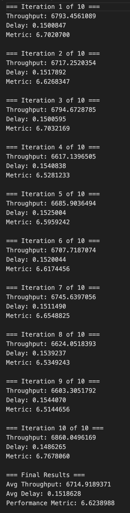
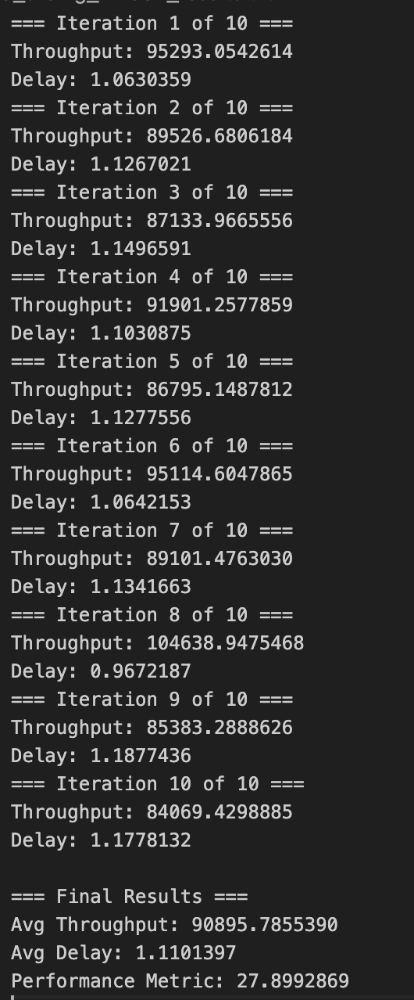
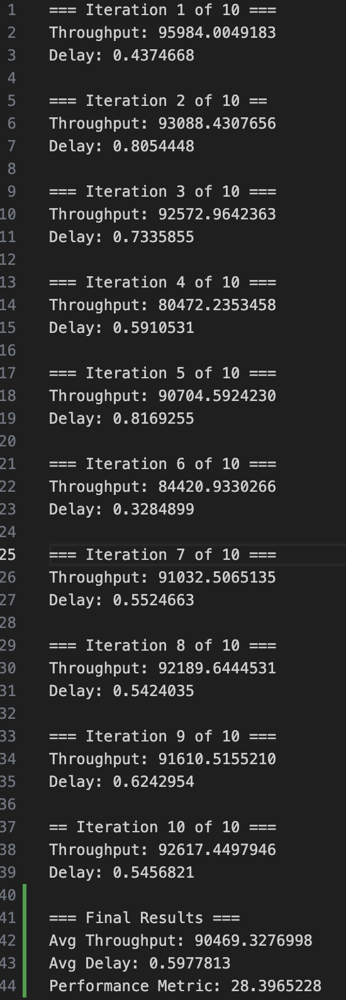

# ECS 152A Project 1: Congestion Control Report

## 1. Stop-and-Wait Protocol

### Description

The implmentation of the Stop and Wait protocool was the easiest out of the three to implement as it is the most basic form of the three for congestion control. First, what the sender does is that it reads the entire MP3 file into memory. Once this is done, it will then divide it into packets of up to 1020 bytes if payload. Each packet will have a 4 byte sequence ID header and preprend it to each packet. The sequnce ID for each packet is also set to the byte offset of that specific chunk within the file, and this helps the reciever know exactly where each piece of the data will actually belong 

The core idea of this protocol and how it is implemented in the code works as follows: the sender is going to tramsit one packet a time over a UDP socket and then it will be blocking until it recieves an ACK from the receiver. If the ACK is recieved within the window that we set for the timeout, then the sender will check if the ACK ID is greater than the current Sequence ID (as the reciever uses cumulative ACK's). If this all goes well, then the ACK will confirm the recepit of the specific packet and the sender will record the round-trip delay for the packet. It will repeat this process until all packets have been sent and acknowledged. If we don;t recieve an ACK before the timeout, then the sender will retransmit the same packet. 

Once all of the data packets have been both sent and also acknowledged, then the sender will go into the connection teardown process. What happens here is that the sender will send an empty packet that will have a sequence ID which will be equal to the total file size. This is basically the sign of the end of transmission. Then the sender waits for the reciever to respond with a message of "fin", and once this is recieved, it will send a FINACK (final acknowledgement packet) and this completes the handshake. Furthemore, throughotu the the entire lifetime of the transmission, the sender is going to tracj the total elapsed time and the per packet delays in order to calculate the throughput (which is the bytes per second) and also the average delay as well.

The main key charateristic of this protocol is that there is only oing to be one packet ever in transmission at a time. Even though thi might seem goof and guarantees simplicity and also good reliability, this is very much underutilzing the netwrok bandwith as the sender is basically waiting for so lonf while waiting for each ACK. We made sure to utilize the python socket library to help us establish a UDP Connection and also the LLm helped us with the byte conversion functions such as `int.to_bytes()` and `.decode()`.

### Results Table

| Iteration | Throughput (bytes/s) | Per-Packet Delay (s) | Performance Metric |
|-----------|---------------------:|---------------------:|-------------------:|
| 1         | 6793.4561            | 0.1500847            | 6.7021             |
| 2         | 6717.2520            | 0.1517892            | 6.6268             |
| 3         | 6794.6729            | 0.1500595            | 6.7032             |
| 4         | 6617.1397            | 0.1540838            | 6.5281             |
| 5         | 6685.9036            | 0.1525004            | 6.5959             |
| 6         | 6707.7187            | 0.1520044            | 6.6174             |
| 7         | 6745.6397            | 0.1511490            | 6.6549             |
| 8         | 6624.0518            | 0.1539237            | 6.5349             |
| 9         | 6603.3052            | 0.1544070            | 6.5145             |
| 10        | 6860.0496            | 0.1486265            | 6.7678             |
| **Average** | **6714.9189**       | **0.1518628**        | **6.6246**         |
| **Std Dev** | **77.8452**         | **0.0018542**        | **0.0814**         |

### Output Screenshot

---

## 2. Fixed Sliding Window Protocol

### Description
The Fixed Sliding Window protocol is a big jump in improvement over the Stop and Wait protocol as this allows multiple packets to be in transmission at the same time. Instead of sending one packet at a time and then waiting for the ACK, we could hypotetcially set a big cwnd (congestion window of size 100) and send all of the packets at once. This is good as we increase the throughput by keeping the pipeline of the netwrok full rather than having the sender wait for so long in idle between each packet

The sender in this protocol is going to create all of the packets upfront annd then store them in a keyed dictionary where it is keyed by the sequence ID. This is used as as a way to keep track of all of the packets that are in the specific window and it also allows for the sender to very quickly access the packets if there is ever a timeout. Futhermore this dictionary is used to maintain an ordered list of the Squence ID's and the teo index pointers that we have. The two index pointers that we have are the `window_base` (which is the oldest unacknowledged packet) and the `next_to_send` (this is going to eb the next packet that is going to be transmitted). The sender will fill the window by transmitting the packets until either the every sincle packet within the window has been sent or if the window is full (100 packets in transmission). 

After sending a burst of packets, the sender switches the socket to non-blocking mode to drain all available ACKs from the buffer without waiting. For each ACK received, it slides the window forward using cumulative acknowledgments — if the receiver sends an ACK with value X, it means everything up to byte X has been received. The window base advances past all packets below that ACK value, allowing new packets to be sent.

After sending a big burst of packets, the sender will swtich the socket to basically be in a non-blocking mode and this will basically drain all of the ACKs from the buffer without it even waiting. Everyt time an ACK is recieved, it will slide the window forward as we have acknowledged all of the packets up to that point (utilzing the cumulative acknowledgements). We basically have it as if the reciever send an ACK that has a value of Z, then it means that everything up to byte Z has been recieved. The window base will then advance pass all of the packets below that specific ACK value, and this will allow the sender to send the next packet within the window. 

If no ACKs are received during the non-blocking drain, the sender performs a blocking receive with a 0.5-second timeout. If even this times out, it triggers a Go-Back-N retransmission: every packet currently in the window is retransmitted. This is a simple but somewhat wasteful strategy, since packets that were successfully received may be unnecessarily retransmitted. The sender also tracks packet send times and ACK times in separate dictionaries to compute per-packet delay, which is calculated as the difference between when a packet was first sent and when its ACK arrived. The connection teardown uses the same FIN/FINACK handshake as Stop-and-Wait. We utilized the Python socket library for the UDP connection.

If we have no ACK's being recived during the non-blocking drain, then the sender will preform a blocking mehcanism with a 0.5 second timeout. If this even times out, it will trigger a Go-Back_N retransmission. This is basicvally a simple but also at the same time could be seen as wasteful as packets that are successfully recieved can be unnecessarily retransmitted. Furthermore, the sender is also going to trck the packet send times and the ACK times in a seperate dictionaries to basically help us compute the per packet delay. This is specficially calculated by taking the difference between the packet was first sent and when the ACK has arrived. Then the connection teardown is basically the same as before as we are going to do the Fin and FINACK handshake. We also utilized the Python socket library for setting up the UDP connection. 

### Results Table

| Iteration | Throughput (bytes/s) | Per-Packet Delay (s) | Performance Metric |
|-----------|---------------------:|---------------------:|-------------------:|
| 1         | 95293.0543           | 1.0630359            | 29.2471            |
| 2         | 89526.6806           | 1.1267021            | 27.4783            |
| 3         | 87133.9666           | 1.1496591            | 26.7494            |
| 4         | 91901.2578           | 1.1030875            | 28.2050            |
| 5         | 86795.1488           | 1.1277556            | 26.6594            |
| 6         | 95114.6048           | 1.0642153            | 29.1917            |
| 7         | 89101.4763           | 1.1341663            | 27.3474            |
| 8         | 104638.9475          | 0.9672187            | 32.1153            |
| 9         | 85383.2889           | 1.1877436            | 26.2044            |
| 10        | 84069.4299           | 1.1778132            | 25.8149            |
| **Average** | **90895.7856**      | **1.1101397**        | **27.9013**        |
| **Std Dev** | **5987.5064**       | **0.0618938**        | **1.8348**         |

### Output Screenshot

---

## 3. TCP Reno Protocol

### Description

The TCP Reno implementation is the most complicated one out of all three protocols, as it involves congestion control that dynamically adjusts the sending rate and the window based on network conditions and how much congestion and the feedback from the receiver. Unlike the Fixed Sliding Window which uses a fixed size window of 100 packets, TCP Reno starts with an initial congestion window (cwnd) size of just 1 packet and it grows based on the network conditions, using the phases the professor taught us in class: Slow Start, Congestion Avoidance, Fast Retransmit, and Fast Recovery.

The first phase is slow start, where the congestion window increases exponentially. When an ACK is sent, then increment the window by 1 which doubles for every RTT. Slow start keeps happening until the the ssthresh is reached by the window. Then this triggers the Congestion Avoidance phase. What happens here is the window grows linearly where the cwnd increases by 1/cwnd for every ACK received. This ensures it does not exceed or waste so much bandwidth so it does not overflow the network with way too much traffic.

The sender also tracks when it receives duplicate ACKs. When it receives three duplicate ACKs, then it thinks that the packet was lost or dropped. This moves onto Fast Retransmit phase. What happens here is instead of just waiting for a timeout, the sender immediately will retransmit the packet that was lost. At the same time, it transitions to Fast Recovery phase by setting ssthresh to half the current cwnd (minimum of 2) and setting cwnd to ssthresh + 3. (this considers the three duplicate ACKs). During Fast Recovery phase, each additional duplicate ACK received will increment cwnd by 1 to allow more packets to be sent. When a new ACK finally arrives, cwnd is goes back down to the ssthresh and the sender exits the Fast Recovery phase.

The most drastic response happens on timeouts. If an ACK isn't received in 0.5 seconds of sending the packet then it thinks the network has way too much congestion. What happens here it will set the ssthresh to half of the congestion window, then reset congestion window back to 1, and resend all of the packet in the current window (Go-Back-N). Now we go back to Slow Start. To calculate the metrics, we followed the ones we did for other protocols. Finally in setting up our connection, we used the builtin socket library and applied all formulas learned in class.

### Results Table

| Iteration | Throughput (bytes/s) | Per-Packet Delay (s) | Performance Metric |
|-----------|---------------------:|---------------------:|-------------------:|
| 1         | 95984.0049           | 0.4374668            | 30.3951            |
| 2         | 93088.4308           | 0.8054448            | 27.7961            |
| 3         | 92572.9642           | 0.7335855            | 28.7269            |
| 4         | 80472.2353           | 0.5910531            | 25.3300            |
| 5         | 90704.5924           | 0.8169255            | 27.0688            |
| 6         | 84420.9330           | 0.3284899            | 27.4556            |
| 7         | 91032.5065           | 0.5524663            | 28.5778            |
| 8         | 92189.6445           | 0.5424035            | 27.9464            |
| 9         | 91610.5155           | 0.6242954            | 28.6048            |
| 10        | 92617.4498           | 0.5456821            | 29.0671            |
| **Average** | **90469.3277**      | **0.5977813**        | **28.0969**        |
| **Std Dev** | **4476.2987**       | **0.1519854**        | **1.3261**         |

### Output Screenshot

---

## 4. Protocol Comparison Summary

| Metric | Stop-and-Wait | Fixed Sliding Window | TCP Reno |
|--------|:-------------:|:--------------------:|:--------:|
| **Avg Throughput (bytes/s)** | 6,714.92 | 90,895.79 | 90,469.33 |
| **Avg Per-Packet Delay (s)** | 0.1519 | 1.1101 | 0.5978 |
| **Avg Performance Metric** | 6.62 | 27.90 | 28.10 |

**Key Observations:**

- **Stop-and-Wait** has the lowest throughput (~6.7 KB/s) due to only allowing one packet in flight at a time, but also has the lowest per-packet delay (~0.15s) since there is no queuing.
- **Fixed Sliding Window** achieves ~13.5x higher throughput than Stop-and-Wait by pipelining up to 100 packets, but has the highest per-packet delay (~1.1s) because many packets are queued in the window.
- **TCP Reno** achieves comparable throughput to Fixed Sliding Window while cutting the per-packet delay nearly in half (~0.6s), resulting in the best overall performance metric. Its adaptive congestion window avoids overwhelming the network, leading to fewer retransmissions and better delay characteristics.

## Submission Certification

I certify that all submitted work is my own work. I have completed all of the assignments on my own without assistance from others except as indicated by appropriate citation. I have read and understand the university policy on plagiarism and academic dishonesty.

**Team Member 1 Contributions**: Worked on the TCP Reno part of report and the algorithm. Collaborated with Raq on the code for Sliding Window and Stop and Wait.

| Kavin Agarwal| KA | 2/12/2026 |
|-----------|-----------|------|
| | | |

**Team Member 2 Contributions**: Worked on the Stop and Wait and Sliding Window part of the report and the algorithm. Collaborated with Kavin on the code for TCP Reno.

| Raquib Alam | RA | 2/12/2026 |
|-----------|-----------|------|
| | | |

